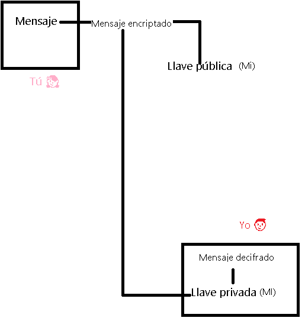
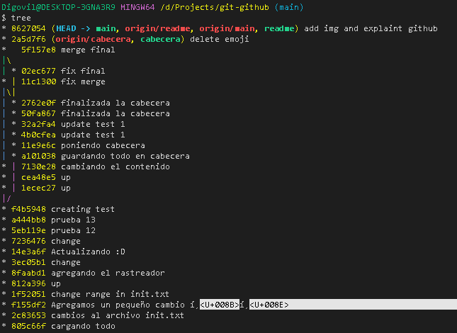

# Git 🎁

Git sólo trabajará 100% bien con archivos de texto plano, es decir te puede decir en que linea fue que cambio, cosa que no ocurre con archivos binarios.

## Configurar quienes somos 😎🤳

Con el un guión usamos las letras y con el doble guión usamos una palabra en este caso --global. Lo que significa que vamos a cambiar todos los usuarios globales.

- Primero pondremos el nombre de usuario:

        git config --global user.name "Digovil"
        
- Luego en el siguiente comando pondremos nuestro email:

        git config --global user.email "dilangvidal@gmail.com"

Para poder ver la configuración por defecto de git:

    git config --list

Para poder ver donde estan guardadas las configuraciones de git

    git config --list --show-origin 

## Inicializar Git 🐱‍🏍

Para este paso se utiliza el comando git init, lo que hace es crearte una carpeta .git, es un repositorio local donde estaremos guardando todos los cambios del proyecto:

    git init

Esto se tiene que hacer en la carpeta central donde se encuentra el proyecto.

## Agregar un nuevo archivo a la base de datos local de Git

Para esto necesitamos primero avisarle de que el archivo existe:

    git add nombreArchivo.extensionArchivo

Por consiguiente necesitamos avisar de que todos los cambios están listos para ser guardados en la base de datos del sistema de control de versiones, para tener un versionamiento del proyecto:

    git commit -m "mensaje de que le quieres dar"

Para avisarle a git que todos los archivos existen:

    git add .

Eso hará que se carguen todos los archivos que contiene el proyecto. Una vez teniendo identificado todos esos archivos, le avisamos que a git nuevamente que ya esta listo todo para que nos guarde el proyecto en la versión en que se encuentra:

    git commit -m "Listo finalizado"

## Comandos de consulta a la base de datos local de Git

- Estado de la base de datos:

        git status

- Cambios historicos hechos, mostrandote las lineas de código anterior, posterior y quién lo cambió, esto te lo muestra con un diff que lo que hace es comparar:

        git show

- Si quiero ver el historial completo de un archivo, con el nombre de la modificación:

        git log nombreArchivo.extensionArchivo

- El commit y el add a la vez, (nota: No funciona para archivos nuevos que no le hayas dado add) :

        git commit -am nombreArchivo.extensionArchivo

## Manejo en repositorio remoto

Para enviar a un repositorio remoto el repositorio local:

    git push

## Sacar archivo de Git Add ⛏

Cached significa que esta todavía en memoria RAM, que no están guardados sus cambios en la base de datos local de git:

    git rm --cached nombreArchivo.extensionArchivo

## Comparando commits 😮

Primero tenemos que ver los commits existente del archivo a comparar

    git log .

De esta forma podemos ver que cosa cambio:

    git diff commit1 commit2

## Staging 🧐

Cuando se inicializa git en un proyecto, se crea un área en memoria ram llamada staging y se crea el repositorio /.git/, cuando tu escribes add este archivo pasa a vivir a staging la cual es un lugar totalmente aislado, que esta esperando a que lo mandes al repositorio local /.git/ o a que lo quites con un rm --cached, cuando tu le das un commit, este archivo se manda para el repositorio local, el cual tiene un nombre por default el cual es master.

El staging es la memoria ram, es el estado temporal donde tu agregas archivos que vas cambiando.

Antes del git add, el archivo esta untrackted (sin rastreo) despues del git add, el archivo está en un estado tracked (rastreado), ahí hace parte de staging, es decir que el archivo está trackeado 

## Traer los cambios de un archivo del repositorio local 🐛

Para ello utilizaremos el comando:

    git pull

## Creando la rama para experimentar 🤗🤩 Rama development

## HotFix 🔥🥵

Arreglo en caliente de la rama actual, donde si se presentan bugs en la rama actual, podemos crear esta nueva rama para poder trabajar comodamente con ella y arreglar los errores. ✨

## Merge 🤜🏿🤛🏿

Esto es cuando unes una rama con otra

## Volver en el tiempo ✈😵

Para volver a una versión anterior todo el proyecto:

- reset --hard, este es el más peligroso puede cambiar absolumente todo al commit anterior:

        git reset nombreCommit --hard

- reset --soft, este cambia al commit anterior pero lo que tengamos en staging sigue en staging:

        git reset nombreCommit --soft

Para volver a una versión anterior un archivo del proyecto:

    git checkout nombreCommit nombreArchivo.extensionArchivo

Para volver a la versión actual:

    git checkout nombreRama nombreArchivo.extensionArchivo

## Diferencias git rm y git reset 🙅🏿‍♂️

### git rm

Este comando nos ayuda a eliminar archivos de Git sin eliminar su historial del sistema de
versiones. Esto quiere decir que si necesitamos recuperar el archivo solo debemos “viajar
en el tiempo” y recuperar el último commit antes de borrar el archivo en cuestión.
Recuerda que git rm no puede usarse así nomás. Debemos usar uno de los flags para
indicarle a Git cómo eliminar los archivos que ya no necesitamos en la última versión del
proyecto:

- git rm --cached: Elimina los archivos de nuestro repositorio local y del área de
staging, pero los mantiene en nuestro disco duro. Básicamente le dice a Git que deje
de trackear el historial de cambios de estos archivos, por lo que pasaran a un estado
untracked.

- git rm --force: Elimina los archivos de Git y del disco duro. Git siempre guarda
todo, por lo que podemos acceder al registro de la existencia de los archivos, de
modo que podremos recuperarlos si es necesario (pero debemos usar comandos
más avanzados).

### git reset

Este comando nos ayuda a volver en el tiempo. Pero no como git checkout que nos deja
ir, mirar, pasear y volver. Con git reset volvemos al pasado sin la posibilidad de volver al
futuro. Borramos la historia y la debemos sobreescribir. No hay vuelta atrás.
Este comando es muy peligroso y debemos usarlo solo en caso de emergencia. Recuerda
que debemos usar alguna de estas dos opciones:

Hay dos formas de usar git reset: con el argumento --hard, borrando toda la
información que tengamos en el área de staging (y perdiendo todo para siempre). O, un
poco más seguro, con el argumento --soft, que mantiene allí los archivos del área de
staging para que podamos aplicar nuestros últimos cambios pero desde un commit
anterior.

- git reset --soft: Borramos todo el historial y los registros de Git pero guardamos
los cambios que tengamos en Staging, así podemos aplicar las últimas
actualizaciones a un nuevo commit.

- git reset --hard: Borra todo. Todo todito, absolutamente todo. Toda la
información de los commits y del área de staging se borra del historial.
¡Pero todavía falta algo!

- git reset HEAD: Este es el comando para sacar archivos del área de staging. No
para borrarlos ni nada de eso, solo para que los últimos cambios de estos archivos no
se envíen al último commit, a menos que cambiemos de opinión y los incluyamos de
nuevo en staging con git add, por supuesto.

## Servidor Remoto 💻

Primero tenemos que clonar dicho repositorio:

    git clone url

Cuando quiero enviar el commit:

    git push

Quiero traer una actualización, entonces utilizamos el git fetch, que lo que hace es traer todos esos cambios al repositorio local, pero no te lo copia en los archivos, para que se copie en sus archivos, se fusiona la ultima versión que está en repositorio local con la versión actual y eso es un merge, pero hay un comando que fusiona ambos conceptos:

    git pull

De esta manera siempre tengo una copia actualizada de lo ultimo que paso en el repositorio

## Ramas 🌿🐒

Para crear una rama:

    git branch nombreRama

Para ver a donde esta apuntando el HEAD 

    git show

Para pasarme a la rama creada

    git checkout nombreRama

# GitHub 🎁♥

## Llaves públicas y privadas

Para que los mensajes se muevan libremente por el internet sin que nadie sepa que dice, necesitamos cifrarlo.

Esto consiste en tengo un mansaje, lo cifro y cuando llega al destino utiliza una contraseña para descifrarlo, pero esto lo hace inseguro porque también lo pueden interceptar. Por tal razón se crearon las llaves públicas y privadas o __cifrado asimetrico de un solo camino__.

Esto consiste en tener una llave pública y una privada, la privada si te la tienes que guardar. La llave pública sigue conectada matemáticamente con la llave privada.

Se cifra el mensaje con la llave pública generada, en consecuencia se genera un nuevo mensaje y dicho mensaje solo puede ser descifrado por la llave privada.

## Seguridad 🛡 

### (Solo para Windows y Linux) 

En cuanto a la seguridad, el nombre de usuario y contraseña se están guardando de manera local en el ordenador. Eso nos hace vulnerable al Password Cracking, es un problema ya que si entran al código fuente, pueden entrar a los proyectos.

En el pc creo mi llave pública y privada, la pública se la envio a github y lo conectamos por un nuevo protocolo, lo conectamos por el protocolo __ssh__.

Github me dará su llave pública, en cuanto a mi llave privada, se le puede agregar una llave adicional para hacerla más fuerte. 😍😎

- Para crear la llave __ssh__ se pone el comando __ssh-keygen__ (como su nombre lo indica, va a generar una clave ssh) __-t__ (esto especifica cual es el algoritmo que usaremos para crear esa llave) __rsa__ (vamos a utilizar el algoritmo rsa que el por el momento es el más popular) __-b__ (se especifica que tan compleja es la llave) __4096__ (Es la complejidad de la llave desde una perspectiva matemática) __-C__ (se indica a que correo electronico va a estar conectada esta llave):

        ssh-keygen -t rsa -b 4096 -C "tucoreo@sudominio.com"

- Luego te pide un __passphrase__ lo que significa contraseña con espacios 💅🏿 está es la contraseña adicional de texto que se le va a poner a nuestra llave pública y privada.

- El key fingerprint es la huella, es una forma de confirmar que la llave es de verdad

- El key's randomart image, es el cuadrito que te aparece, es una forma de compartir la llave.

- Necesitamos revisar que el servidor de __ssh__ este encendido, es un pequeño programa que esta revisando que las llaves estan corriendo para conectarlo a un servidor remoto:

        eval $(ssh-agent -s)

- El comando anterior lo tienes que ejecutar en bash y sabes si esta corriendo o no si te da esto como resultado __Agent pid Algunnumero__

- El simbolo __~__ es una forma de decir __/c/Users/NombreUsuario__

- Ahora vamos a agregar la llave que acabamos de crear:

        ssh-add ~/.ssh/id_rsa

- En Github:

    - Settings > SSH keys and GPG keys > New SSH key 
    
Justo en ese apartado le insertas el contenido  de tu llave pública que porcierto es la que tiene la extensión .pub

- Luego vamos a nuestro repositorio, le copiamos el ssh:

        git@github.com:NombreUsuario/NombreRepositorio.git

- Vamos a ver los links a donde esta conectado el repositorio:

        git remote -v

Eso nos mostrará algo así:

    origin  https://github.com/Digovil/git-github.git (fetch)
    origin  https://github.com/Digovil/git-github.git (push) 

- Ahora vamos ese protocolo https a ssh 😁

        git remote set-url origin git@github.com:Digovil/git-github.git

## Tags y versiones

- Esto te muestra todos los log y de manera grafica te muestra los merge que han tenido tus ramas:

        git log --all --graph

- Esto te muestra la historia del proyecto, como arranco y te muestra el id de lo que ocurrio:

        git log --all --graph --decorate --oneline

- Ese comando largisimo le puedes poner un alias:

        alias tree="git log --all --graph --decorate --oneline"

- El resultado:

    

- Ahora para crear una versión desde el id del commit  __5eb119e en la prueba 12__:

        git tag -a v1.0 -m "starting with test 12" 5eb119e

- Para ver cuantos tags tenemos en git:

        git tag

- Para ver los tags y los commit de los tags:

        git show-ref --tags

- Ahora debemos enviarlo a github:

        git push origin --tags

- Borrar tags: 

        git tag -d nombreTag

- Borrar tags en github:

        git push origin: refs/tags/nombreTag

## Ramas

- Ramas que existen y su historia:

        git show-branch

        git show-branch --all

- Abrir toda la historia de manera visual:

        gitk

- Traerse una rama del repositorio:

        git pull origin nombreRama

Este proceso de ramificación se tiene que hacer desde la versión más reciente.

- para enviar una rama a github:

        git push origin nombreRama

No se recomienda que nuestros archivos completamente binarios se carguen de buenas a primeras, porque trae un inconveniente, de que se le suma peso a los repositorios.

## Flujo de trabajo

El flujo de trabajo existen dos ramas, la primera __main__ y la __staging-develop__.

El __pull request__ es un estado medio antes de enviar el proyecto, del __feature__ al __stangin-develop__, donde los miembros del equipo aprueban para probarlo en stagin, luego de eso se fusional los cambios con la rama main, despues se hace el __pull request__ que es una caracteristica de github.